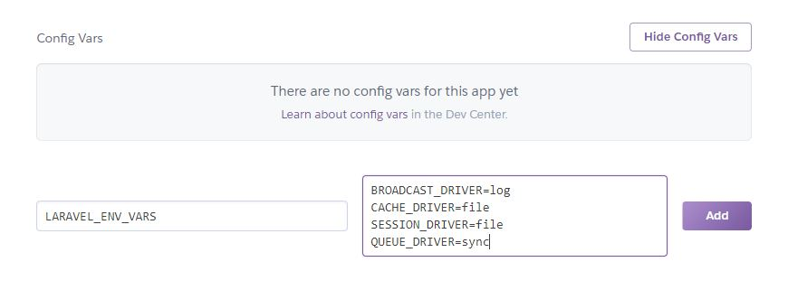

<h1 align="center">Heroku Buildpack: PHP + Laravel</h1>
<p align="center"></p>
<p align="center">
	Forked from the Official <a href="https://github.com/heroku/heroku-buildpack-php">Heroku PHP Buildpack</a> with added support for Laravel Applications.
</p>


## Usage

You'll need to use at least an empty `composer.json` in your application.

    echo '{}' > composer.json
    git add composer.json
    git commit -m "add composer.json for PHP app detection"

If you also have files from other frameworks or languages that could trigger another buildpack to detect your application as one of its own, e.g. a `package.json` which might cause your code to be detected as a Node.js application even if it is a PHP application, then you need to manually set your application to use this buildpack:

    heroku buildpacks:set https://github.com/gerardbalaoro/heroku-buildpack-laravel.git

Please refer to [Dev Center](https://devcenter.heroku.com/categories/php) for further usage instructions.


## Environment Variables

The buildpack will **replace** the existing **.env** file using variables from your **Heroku Config Vars**.

### Generic Variables

The buildpack will recognize the **APP_**, **DB_**, and **MAIL_** variables set in Heroku.

```sh
# Adds APP_NAME="Laravel App" to .env file
heroku config:set APP_NAME="Laravel App"
```

The following are the supported application variables:
- APP_NAME
- APP_ENV
- APP_DEBUG
- APP_URL

For database configuration variables:
- DB_CONN (Database Driver)
- DB_HOST
- DB_PORT
- DB_USER
- DB_PASS
- DB_NAME (Database Name)

For email configuration variables:
- MAIL_DRIVER
- MAIL_HOST
- MAIL_USER
- MAIL_PASS
- MAIL_PORT

### Additional Variables

For environment variables not metioned above, define them in the config variable **LARAVEL_ENV_VARS** and it will automatically be appended to the **.env** file.

```sh
# Adds BROADCAST_DRIVER=log to .env file
heroku config:set LARAVEL_ENV_VARS=BROADCAST_DRIVER=log
```

Unfortunately, the `heroku config:set` command only works for single-line strings, for multiple environment variables, set them at your Heroku application dashboard under the settings tab.




## Laravel Commands

The buildpack automatically runs the following artisan commands:

```sh
php artisan key:generate
php artisan view:clear
```

To run additional commands, set assign them to the config variable **LARAVEL_COMMANDS**

```sh
# Executes php artisan migrate:refresh
heroku config:set LARAVEL_COMMANDS=php artisan migrate:refresh
```


## HTTP Basic Authentication
This will generate an **.htpasswd** file based of the config variable **HT_AUTH**

```sh
# Executes htpasswd -cb .htpasswd {username} {password}
heroku config:set HT_AUTH={username} {password}
```

It will also append the authentication code in **public/.htaccess**

```apa
AuthType Basic
AuthName "Restricted Access"
AuthUserFile /app/.htpasswd
Require valid-user
```

